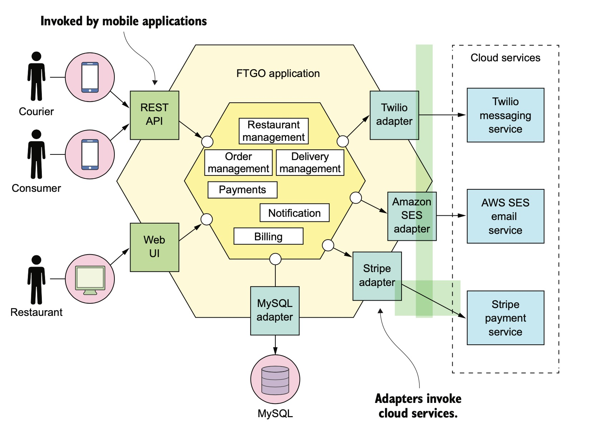
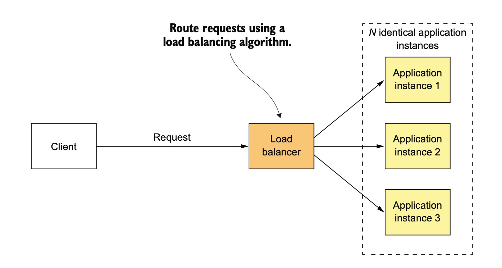
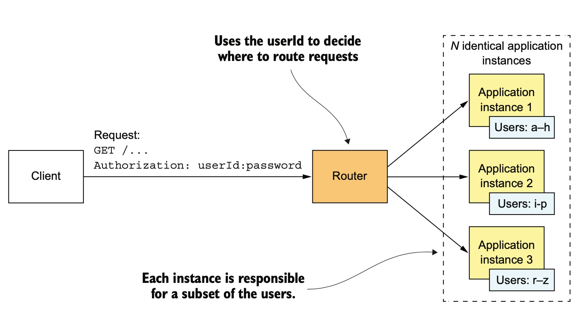
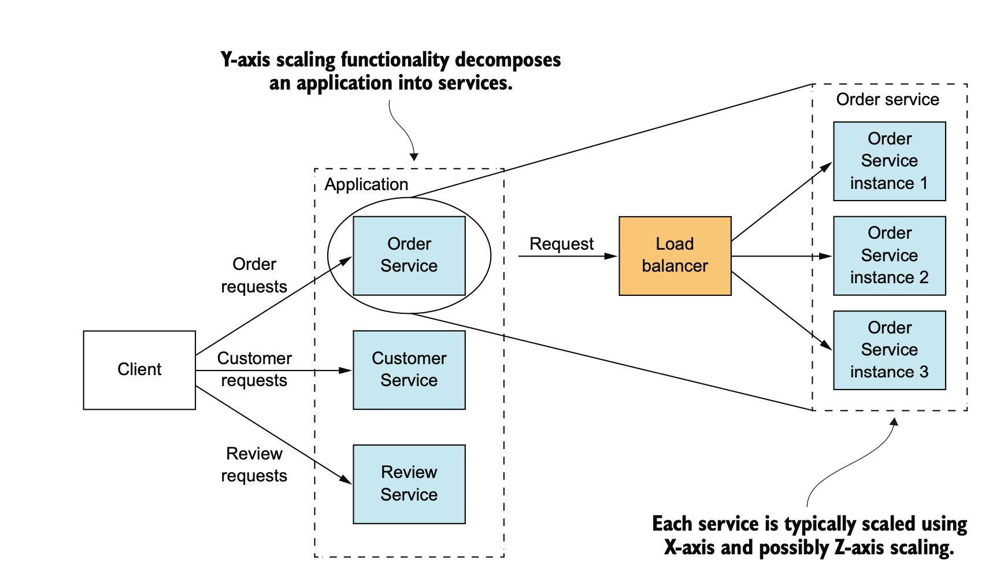
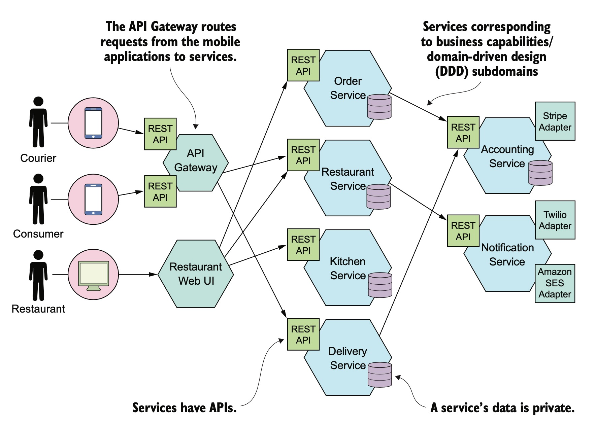
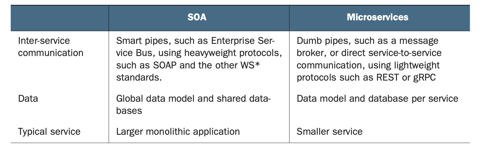
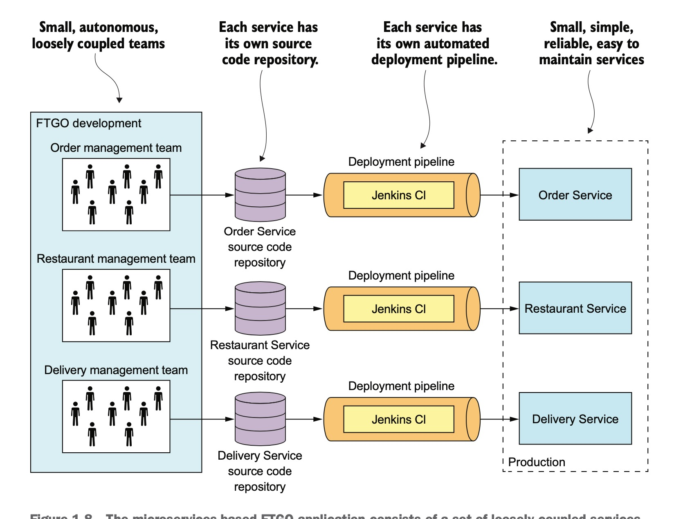

从单体架构到微服务架构
=================

## 1. 何为单体架构？

## 2. 单体架构的好处

* 开发简单
  所有开发者都在同一个代码库
* 容易大修大改
  改代码，改数据库，编译，部署
* 部署简单
  一份代码，直接打包发布即可。
* 测试简单
* 扩容简单
  在一个负载均衡后运行多个实例

## 3. 单体架构的缺点

随着时间的推移，代码库会越来越大，上述事情开始变的不简单。 团队变得很大， 多个开发团队，每个团队负责一部分功能。

* 项目太多功能，太复杂，看着都吓人。

* 开发变慢
  代码难以理解，没有任何一个人能理解所有的代码。
* 提交代码到生产环境变得比较困难
  尽管采用了敏捷开发，但因为很多功能在进行，很多人在提交，合并变的比较困难， 测试也会花很多的时间。
* 扩容变得困难
  不同的模块对硬件的要求可能不一样
* 软件的可靠性难以保证
* 技术栈难以升级

## 4. 何为微服务架构

### 4.1 扩容立方体

#### 4.1.1. X轴扩容

#### 4.1.2. Z轴扩容

#### 4.1.3. Y轴扩容

### 4.2 微服务本身是一种模块化
### 4.3 每个一个服务都有自己的数据库
### 4.4 微服务架构示意图

### 4.5 SOA(Service oriented architecture) VS Microservice architecture

### 4.6 微服务的优点

* 不管项目的大小，复杂度，持续集成变得比较容易
  
* 服务比较小，容易维护
* 各个服务独立部署
* 每个服务器可以单独扩容
* 每个服务由一个团队负责，团队的自治能力强。
* 可以灵活低成本的采用新技术
* 容错能力更强
  

### 4.7 微服务的缺点

* 拆分系统比较难
* 分布式系统很复杂
* 部署跨服务的功能需要认真协调
* 什么时候从单体迁移到微服务难以确定。

### 4.8  微服务架构模式总览

[ 微服务架构模式总览](https://microservices.io/patterns/microservices.html)

### 4.9 