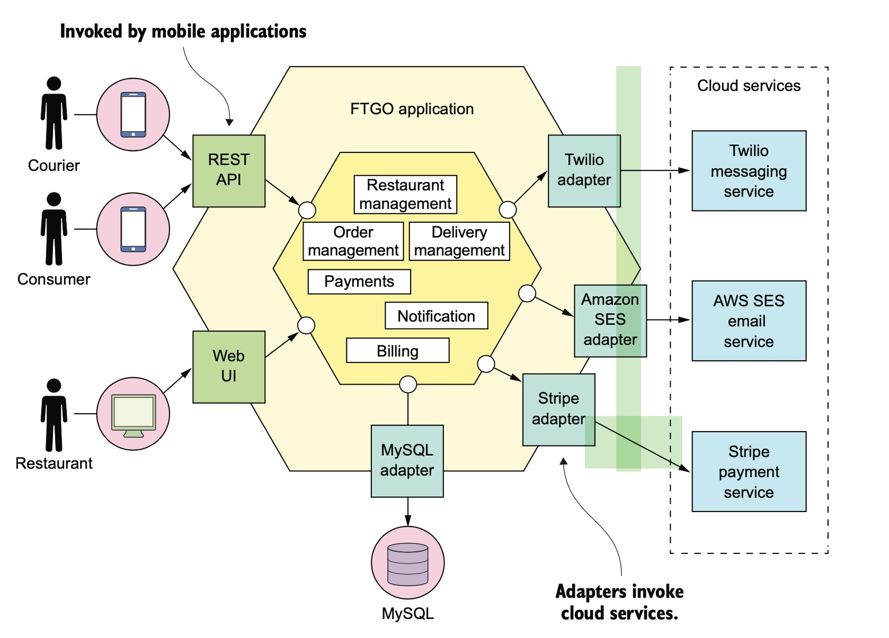
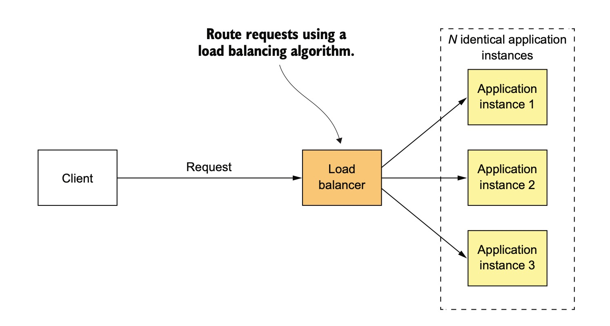
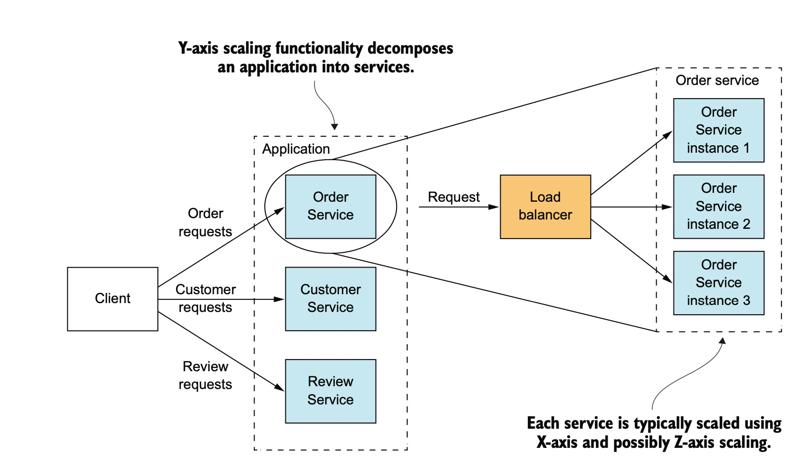
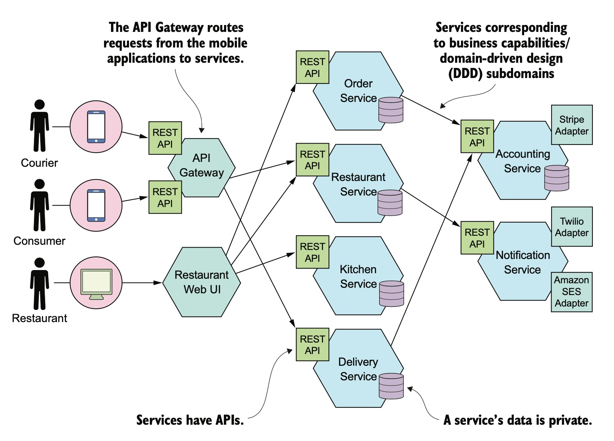

从单体架构到微服务架构
=================

- [从单体架构到微服务架构](#从单体架构到微服务架构)
  - [1. 何为单体架构？](#1-何为单体架构)
  - [2. 单体架构的好处](#2-单体架构的好处)
  - [3. 单体架构的缺点](#3-单体架构的缺点)
  - [4. 何为微服务架构](#4-何为微服务架构)
    - [4.1 扩容立方体](#41-扩容立方体)
      - [4.1.1. X轴扩容](#411-x轴扩容)
      - [4.1.2. Z轴扩容](#412-z轴扩容)
      - [4.1.3. Y轴扩容](#413-y轴扩容)
    - [4.2 微服务本身是一种模块化](#42-微服务本身是一种模块化)
    - [4.3 每个一个服务都有自己的数据库](#43-每个一个服务都有自己的数据库)
  - [5. 微服务架构示意图](#5-微服务架构示意图)
  - [6. SOA(Service oriented architecture) VS Microservice architecture](#6-soaservice-oriented-architecture-vs-microservice-architecture)
  - [7. 微服务的优点](#7-微服务的优点)
  - [8. 微服务的缺点](#8-微服务的缺点)
  - [9. 微服务架构模式总览](#9-微服务架构模式总览)
  - [10. 微服务架构天然适合大型组织](#10-微服务架构天然适合大型组织)

## 1. 何为单体架构？

## 2. 单体架构的好处

* 开发简单
  所有开发者都在同一个代码库
* 容易大修大改
  改代码，改数据库，编译，部署
* 部署简单
  一份代码，直接打包发布即可。
* 测试简单
* 扩容简单
  在一个负载均衡后运行多个实例

## 3. 单体架构的缺点

随着时间的推移，代码库会越来越大，上述事情开始变的不简单。 团队变得很大， 多个开发团队，每个团队负责一部分功能。

* 项目太多功能，太复杂，看着都吓人。

* 开发变慢
  代码难以理解，没有任何一个人能理解所有的代码。
* 提交代码到生产环境变得比较困难
  尽管采用了敏捷开发，但因为很多功能在进行，很多人在提交，合并变的比较困难， 测试也会花很多的时间。
* 扩容变得困难
  不同的模块对硬件的要求可能不一样
* 软件的可靠性难以保证
* 技术栈难以升级

## 4. 何为微服务架构

### 4.1 扩容立方体

#### 4.1.1. X轴扩容

#### 4.1.2. Z轴扩容

#### 4.1.3. Y轴扩容

### 4.2 微服务本身是一种模块化
### 4.3 每个一个服务都有自己的数据库

## 5. 微服务架构示意图

## 6. SOA(Service oriented architecture) VS Microservice architecture

## 7. 微服务的优点

* 不管项目的大小，复杂度，持续集成变得比较容易
  
* 服务比较小，容易维护
* 各个服务独立部署
* 每个服务器可以单独扩容
* 每个服务由一个团队负责，团队的自治能力强。
* 可以灵活低成本的采用新技术
* 容错能力更强
  

## 8. 微服务的缺点

* 拆分系统比较难
* 分布式系统很复杂
* 部署跨服务的功能需要认真协调
* 什么时候从单体迁移到微服务难以确定。

## 9. 微服务架构模式总览

[ 微服务架构模式总览](https://microservices.io/patterns/microservices.html)

## 10. 微服务架构天然适合大型组织