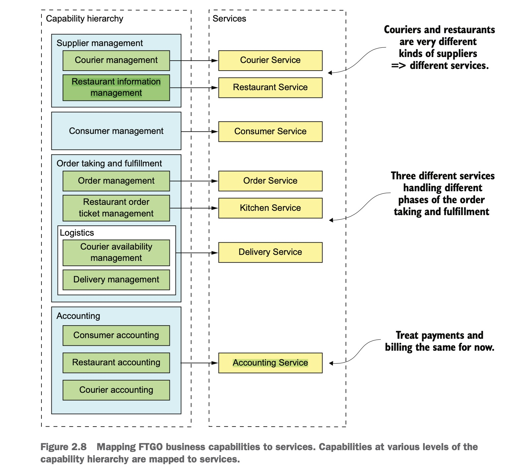
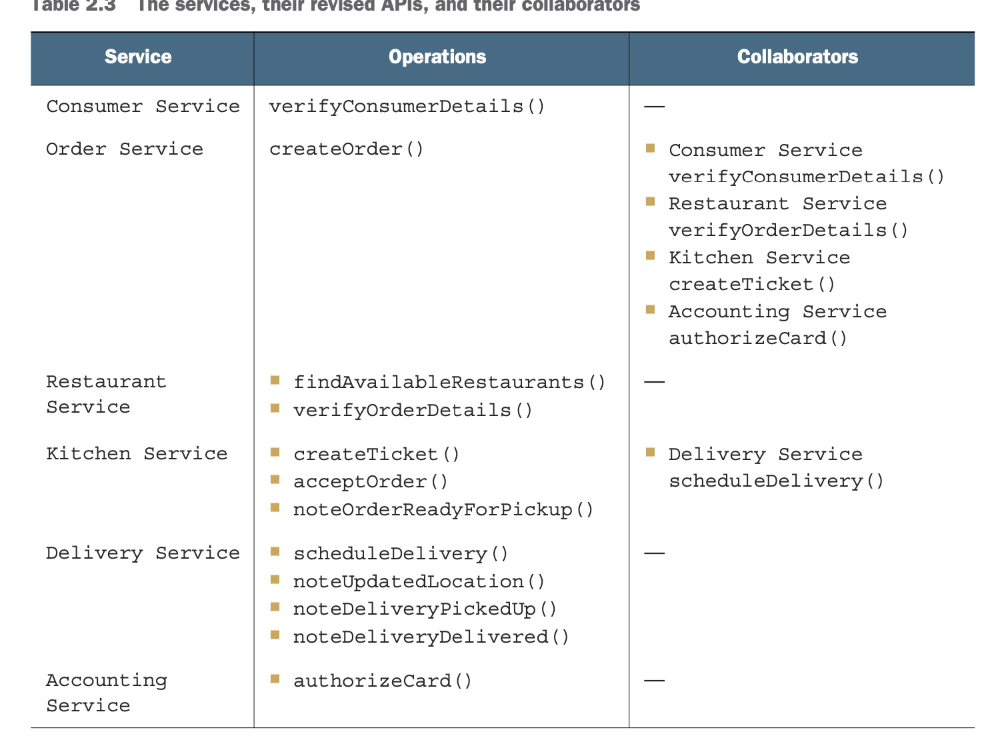

怎样拆分系统为微服务
===============
- [怎样拆分系统为微服务](#怎样拆分系统为微服务)
  - [1. 何为架构？ 有哪些架构风格?](#1-何为架构-有哪些架构风格)
  - [2. 动手拆分](#2-动手拆分)
    - [2.1 按业务拆分](#21-按业务拆分)
  - [2.2 按子领域拆分](#22-按子领域拆分)
  - [2.3 拆分原则](#23-拆分原则)
  - [SINGLE RESPONSIBILITY PRINCIPLE(单一职责原则)](#single-responsibility-principle单一职责原则)
  - [COMMON CLOSURE PRINCIPLE(共同封闭原则)](#common-closure-principle共同封闭原则)
  - [2.4 拆分可能会遇到的障碍](#24-拆分可能会遇到的障碍)
  - [2.5 定义服务接口](#25-定义服务接口)
  

## 1. 何为架构？ 有哪些架构风格?
## 2. 动手拆分

### 2.1 按业务拆分

比如， 在线电商， 订单管理，库存管理，发货管理。

## 2.2 按子领域拆分

DDD（领域驱动设计，Domain driven design）

子领域

限界上下文

## 2.3 拆分原则

## SINGLE RESPONSIBILITY PRINCIPLE(单一职责原则)

## COMMON CLOSURE PRINCIPLE(共同封闭原则)

## 2.4 拆分可能会遇到的障碍

* 网络延迟
* 因为同步调用减少可用性
* 获取一致的数据
* 神类问题

## 2.5 定义服务接口

分为两种, 操作（既有系统级的操作，也有服务之间的协同）, 事件（多用于服务间的数据协同）。

