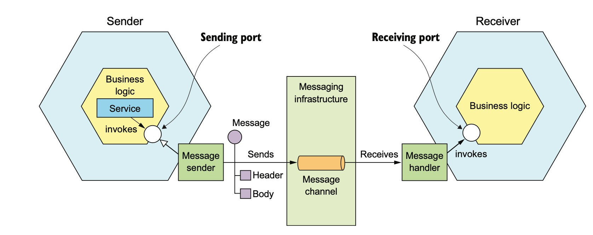
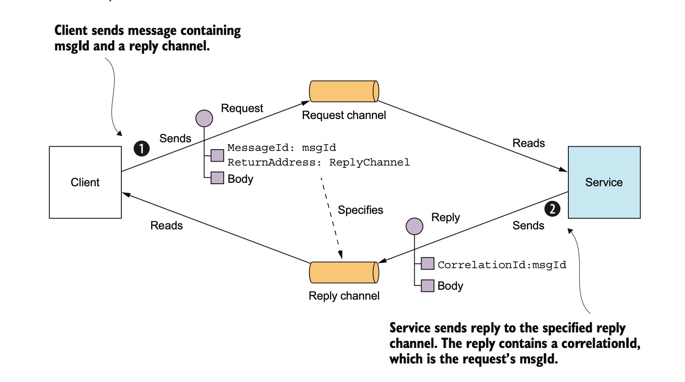

微服务间进程通讯
============
- [微服务间进程通讯](#微服务间进程通讯)
  - [1. 有哪些通讯方式？](#1-有哪些通讯方式)
  - [2. 通讯风格](#2-通讯风格)
  - [3. 消息的格式](#3-消息的格式)
  - [4. 基于消息队列的通讯模式](#4-基于消息队列的通讯模式)
    - [4.1 如何基于消息队里实现请求回复模式](#41-如何基于消息队里实现请求回复模式)
    - [4.2 如何处理重复消息？](#42-如何处理重复消息)
    - [4.3 如何保证消息顺序？](#43-如何保证消息顺序)
    - [4.4 事务中的消息](#44-事务中的消息)

## 1. 有哪些通讯方式？

RPC, GRPC, Message Queue, HTTP(RESTfull, GraphQL)

## 2. 通讯风格

第一个维度

* 1对1
  客户端的请求只被一个服务处理
* 1对多
  客户端的请丢被多个服务处理

第二个维度

* 同步调用
* 异步调用

## 3. 消息的格式

* 纯文本
* 二进制(Protobuff, Apache Thrift)
  
## 4. 基于消息队列的通讯模式

1. 点对点
2. 订阅(publish-subscribe)

###  4.1 如何基于消息队里实现请求回复模式

### 4.2 如何处理重复消息？

### 4.3 如何保证消息顺序？

### 4.4 事务中的消息

比如在OrderService创建订单的过程中，需要发布一个“新订单”事件， KitchenService服务订阅了它。OrderService需要确保，“新订单”，这个时间在一个数据库事务中产生。

[事务中的消息](./1627516258927.jpg)
