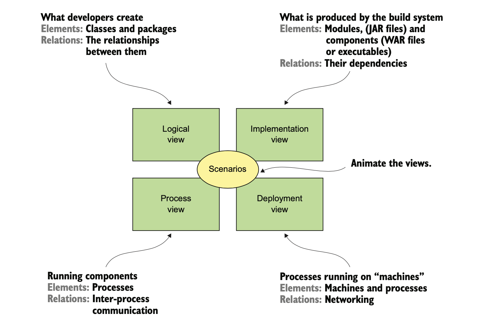
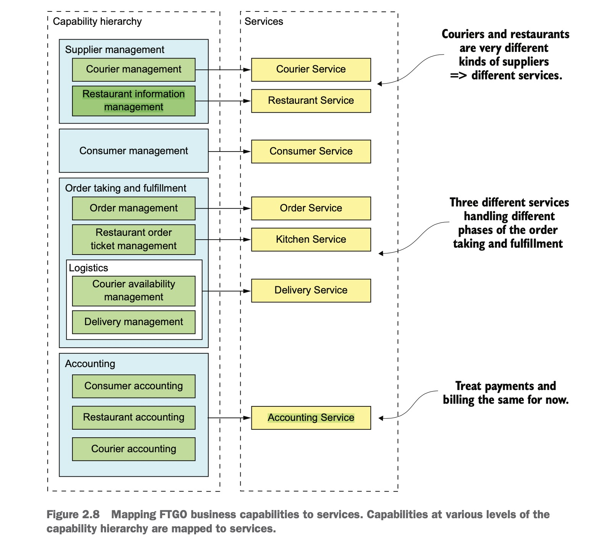
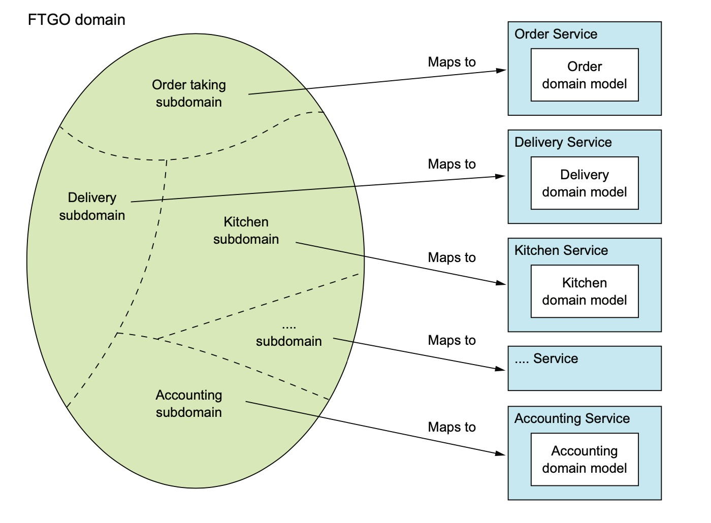
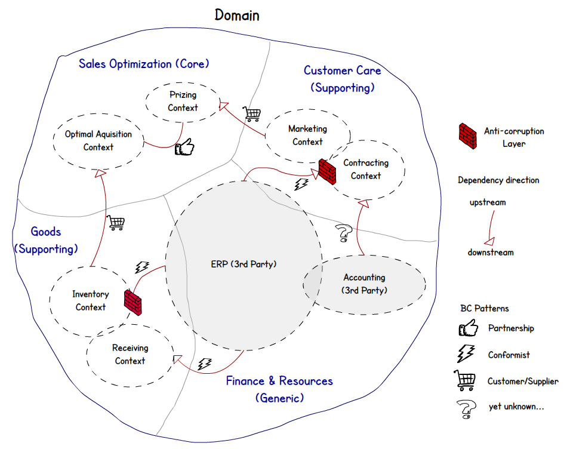
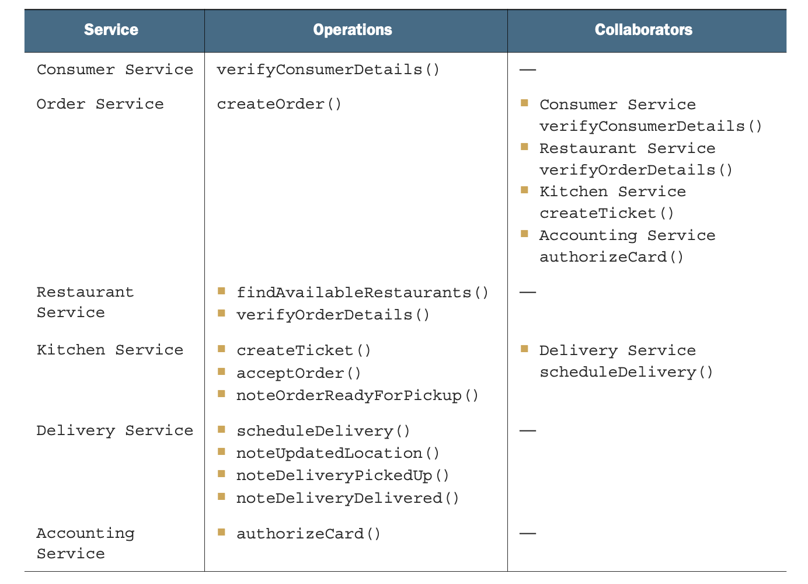

怎样拆分系统为微服务
===============
- [怎样拆分系统为微服务](#怎样拆分系统为微服务)
  - [1. 何为架构？](#1-何为架构)
  - [2. 有哪些架构风格?](#2-有哪些架构风格)
  - [3. 动手拆分](#3-动手拆分)
    - [3.1 按业务拆分](#31-按业务拆分)
  - [3.2 按子领域拆分](#32-按子领域拆分)
  - [3.3 拆分原则](#33-拆分原则)
    - [SINGLE RESPONSIBILITY PRINCIPLE(单一职责原则)](#single-responsibility-principle单一职责原则)
    - [COMMON CLOSURE PRINCIPLE(共同封闭原则)](#common-closure-principle共同封闭原则)
  - [3.4 拆分可能会遇到的障碍](#34-拆分可能会遇到的障碍)
  - [3.5 定义服务接口](#35-定义服务接口)
  - [相关书籍](#相关书籍)
  

## 1. 何为架构？ 

>The software architecture of a computing system is the set of structures needed to reason about the system, which comprise software elements, relations among them, and properties of both.

1. 从四个纬度来看

1. 为什么要有架构？

可伸缩、可靠性、安全性、可快速的交付

## 2. 有哪些架构风格?

三层架构、六边形架构、微服务架构

## 3. 动手拆分

user story  

1个user story可能会有多个场景， 场景pre-conditions 和 post-conditions

user story 能产生

 domain model & operation

### 3.1 按业务拆分

比如， 在线电商， 订单管理，库存管理，发货管理。

## 3.2 按子领域拆分

DDD（领域驱动设计，Domain driven design）

1. 领域和子领域

核心领域、通用子域、支撑子域

2. 限界上下文

3. 实体和值对象

4. 聚合和聚合根

仓储模式、工厂模式

5. 领域事件
   
6. DDD分层架构

六边形架构

## 3.3 拆分原则

### SINGLE RESPONSIBILITY PRINCIPLE(单一职责原则)

### COMMON CLOSURE PRINCIPLE(共同封闭原则)

## 3.4 拆分可能会遇到的障碍

* 网络延迟
* 因为同步调用减少可用性
* 获取一致的数据
* 神类问题

## 3.5 定义服务接口

分为两种, 操作（既有系统级的操作，也有服务之间的协同）, 事件（多用于服务间的数据协同）。

## 相关书籍

* 实现领域驱动设计
* 中台架构与实现

