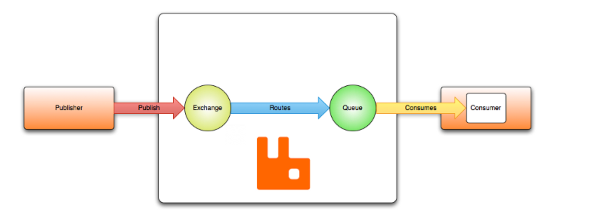
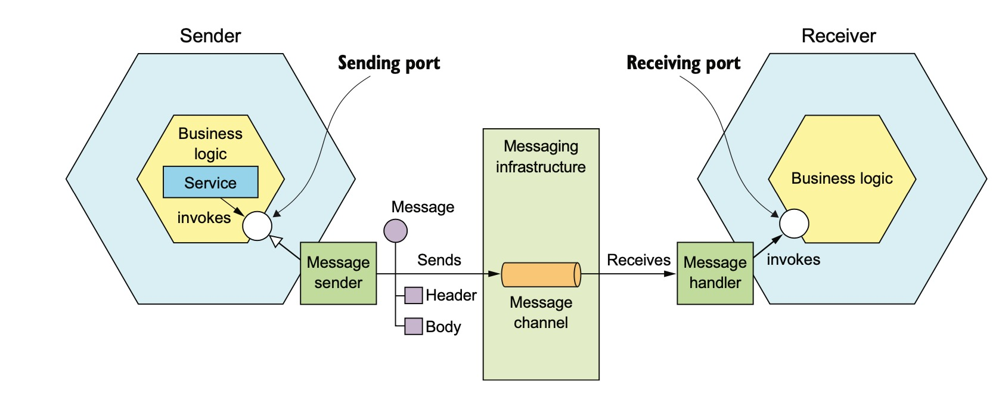
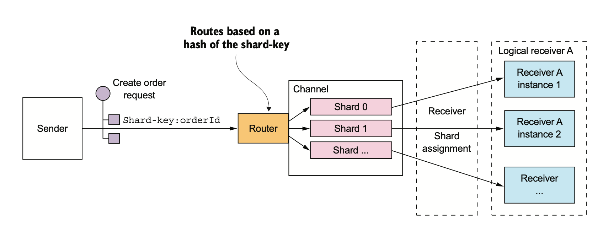
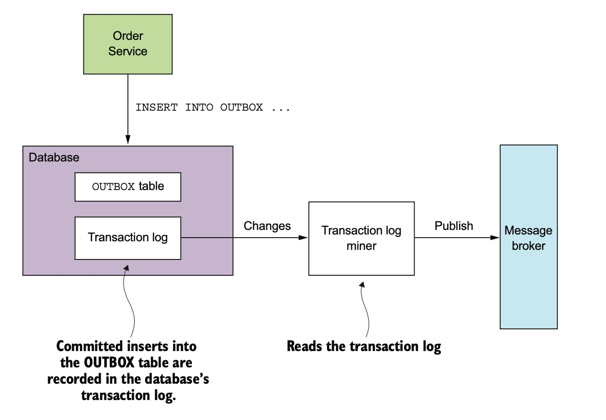

微服务间进程通讯
============
- [微服务间进程通讯](#微服务间进程通讯)
  - [1.1 通讯风格](#11-通讯风格)
  - [1.2 消息的版本](#12-消息的版本)
  - [1.3 消息的格式](#13-消息的格式)
  - [1.4 有哪些通讯方式？](#14-有哪些通讯方式)
  - [2.1 基于消息队列的通讯模式](#21-基于消息队列的通讯模式)
    - [2.1.1 消息队列介绍](#211-消息队列介绍)
    - [2.2 如何基于消息队里实现请求回复模式](#22-如何基于消息队里实现请求回复模式)
    - [2.3 如何处理重复消息？](#23-如何处理重复消息)
    - [2.4 一个生产者，多个消费者，如何确保一个订单的消息派发给同一个的消费者， 且保证消息的顺序？](#24-一个生产者多个消费者如何确保一个订单的消息派发给同一个的消费者-且保证消息的顺序)
    - [2.5 事务中的消息](#25-事务中的消息)

## 1.1 通讯风格

第一个维度

* 1对1
  客户端的请求只被一个服务处理
* 1对多
  客户端的请丢被多个服务处理

第二个维度

* 同步调用
* 异步调用

## 1.2 消息的版本

## 1.3 消息的格式

* 纯文本
* 二进制(Protobuff, Apache Thrift)
  
[Beating JSON performance with Protobuf](https://auth0.com/blog/beating-json-performance-with-protobuf/)

## 1.4 有哪些通讯方式？

RPC, GRPC, Message Queue, HTTP(RESTfull, GraphQL)

## 2.1 基于消息队列的通讯模式

### 2.1.1 消息队列介绍

connection

exchange 

channel

queue

[消息队列的概念](https://www.rabbitmq.com/tutorials/amqp-concepts.html)

*  点对点（point to point）
*  订阅(publish-subscribe)

###  2.2 如何基于消息队里实现请求回复模式

### 2.3 如何处理重复消息？

### 2.4 一个生产者，多个消费者，如何确保一个订单的消息派发给同一个的消费者， 且保证消息的顺序？

[RabbitMQ Shading](https://github.com/rabbitmq/rabbitmq-sharding)
[rabbitmq-message-order-of-delivery](https://stackoverflow.com/questions/21363302/rabbitmq-message-order-of-delivery)

### 2.5 事务中的消息

比如在OrderService创建订单的过程中，需要发布一个“新订单”事件， KitchenService服务订阅了它。OrderService需要确保，“新订单”，这个时间在一个数据库事务中产生。

