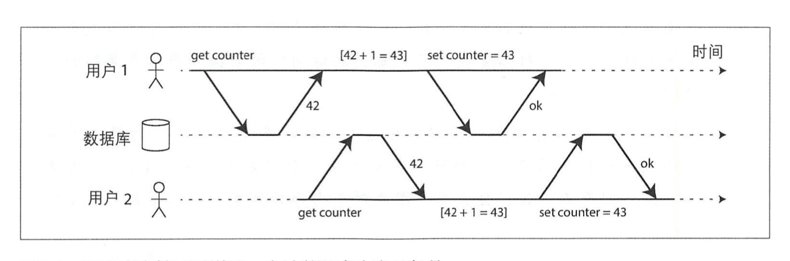
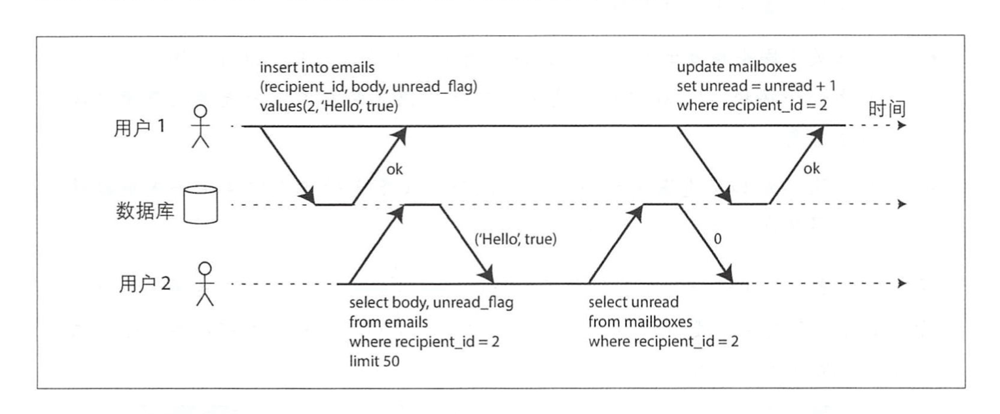
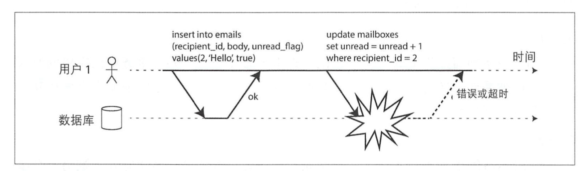
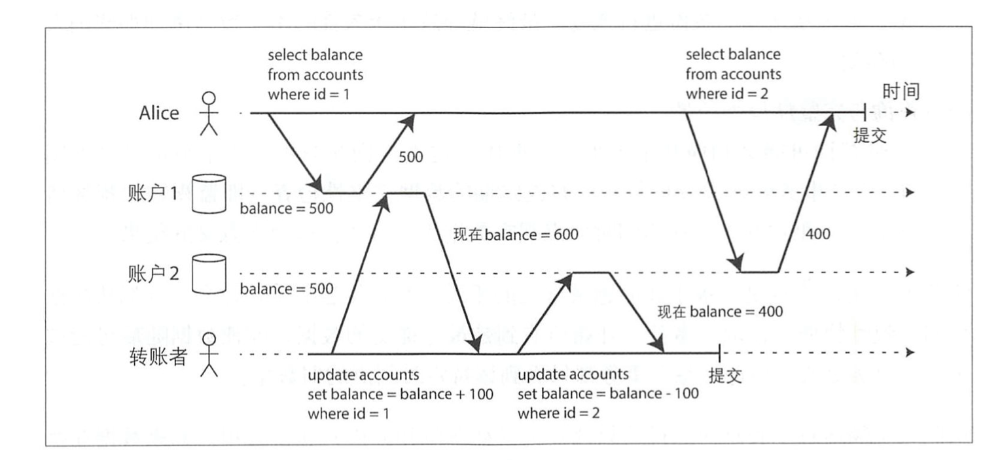

深入理解事务
================

请阅读《数据密集型应用系统设计》-第7章，这是为了让大家理解，在跨服务，没有数据库事务的情况，我们在微服务系统要面临哪些问题。

- [深入理解事务](#深入理解事务)
  - [1. 深入理解事务](#1-深入理解事务)
    - [1.1 ACID的含义](#11-acid的含义)
    - [1.2 单对象与多对象事务操作](#12-单对象与多对象事务操作)
      - [1.2.1 多对象](#121-多对象)
      - [1.2.2 单对象](#122-单对象)
  - [2. 多对象事务的必要性](#2-多对象事务的必要性)
  - [3. 处理错误与中止的方式](#3-处理错误与中止的方式)
  - [4. 弱隔离级别](#4-弱隔离级别)
    - [4.1 读-提交](#41-读-提交)
      - [4.1.1 实现读-提交](#411-实现读-提交)
    - [4.2 快照级别隔离与可重复读](#42-快照级别隔离与可重复读)
      - [4.2.1 实现快照级别隔离](#421-实现快照级别隔离)
  - [5. 防止更新丢失](#5-防止更新丢失)
    - [5.1 原子写操作](#51-原子写操作)
    - [5.1 显式加锁](#51-显式加锁)
    - [5.2 自动检测更新丢失](#52-自动检测更新丢失)
    - [5.3 原子比较和设置](#53-原子比较和设置)
    - [5.4 写倾斜与幻读](#54-写倾斜与幻读)
    - [5.5 串行化](#55-串行化)
  - [6. 例子：Magento库存超卖问题。](#6-例子magento库存超卖问题)
    - [6.1  准备测试数据](#61--准备测试数据)
    - [6.2 模拟超卖情况](#62-模拟超卖情况)
    - [6.3 总结](#63-总结)

## 1. 深入理解事务

关系型数据库与NoSQL的数据库的在事务上的区别，很多NoSQL放弃了事务支持，或者将其替换为比以前弱得多的保证。

### 1.1 ACID的含义

* 原子性( Atomicity)

    如果一系列写操作中间发生了错误，则事务必须中止，并且事务中已完成的写入 应当被丢弃。换言之，不用担心数据库的部分失败，它总是保证要么全部成功， 要么全部失败。

* 一致 性( Consistency)
  
  指对数据有特定的预期状态，任何数据更改必须满足这些状态约束(或者恒等条件)。例如，对于一个账单系统，账户的贷款余额应和借款余 额保持平衡。如果某事务从一个有效的状态开始，并且事务中任何更新操作都没有违背约束，那么最后的结果依然符合有效状态。一致性本质上要求应用层来维护状态一致(或者恒等)，应用程序有责任正确地 定义事务来保持一致性.

* 隔离性( Isolation)
  
  同时运行的事务不应相互干扰。例如，如果某个事务进行多次写人，则另 一个事 务应该观察到的是其全部完成(或者一个都没完成)的结果，而不应该看到中间的部分结果。

    

* 持久性( Durability)
  数据库系统本质上是提供一个安全可靠的地方来存储数据而不用担心数据丢失等。

### 1.2 单对象与多对象事务操作

#### 1.2.1 多对象

场景： 用于1发送一封邮件给用户2，未读邮件数目采用单独的单独的字段记录。

* 违反隔离性

    用户2遇到些异常情况:邮箱列表已显示了未读消息，但计数器却还未更 新，所显式的数目是0。隔离性将保证用户2看到要么是更新后的电子邮件和更新后的计数器，要么是二者都未更新，而不会是两者不一致。下图表示，用户2的事务读取了用于1的事务中尚未提交的写入(“脏读”)， 违反了隔离性。

    

* 违法原子性

    

#### 1.2.2 单对象

场景： 向数据库写入 20KB的SON文档，假设，发送了第一个10KB之后网络连接中断，数据库是否只存储了无法完整解析的1OKB JSON.

原子性和隔离性也同样适用于单个对象的更新。 

* 原子自增(避免读取-修改-写回)
* 原子比较-设置

虽然又称“轻量级事务”，但通常，事务针对的是多个对象，将多个操作聚合 为一个逻辑执行单元。

## 2. 多对象事务的必要性

许多分布式数据存储系统不支持多对象事务，主要是因为当出现跨分区时，多对象事
务非常难以正确实现，同时在高可用或者极致性能的场景下也会带来很多负面影响。但是，分布式数据库实现事务并非不可能，并不存什么原理上的限制。

是否所有应用都需要多对象事务呢?是否可能只用键-值数据模型和单对象操作就
可以满足应用需求? 的确有一些情况，只进行单个对象的插入、更新和删除就足够了。还有许多其他情况要求写入多个不同的对象并进行协调，比如：


* 对于关系数据模型，表中的某行可能是另一个表中的外键。类似地， 在图数据模 型中，顶点具有多个边链接到其 他的顶 点。多对象事务 用以确保这些外键引用的 有效性， 即当插入多个相互引用的记录时，保证外键总是最新、正确的， 否则数 据更新就变得毫无意义。
* 对于文档数据模型，如果待更新的字段都在同 一个文档中，则可视为单个对象， 此时不需要多对象事务。但是，缺少join支持的文档数据库往往会滋生反规范化 ，上面的“邮件”示例，当更新这种非规范化数据时，就需要一次更新多个文档。此时多对象事务就可以有效防止非规范化数据之间出现不同步。
* 对于带有二级索引的数据库(除了纯粹键-值存储以外几乎所有其他系统都支持二级索引)，每次更改值时都需要同步更新索引。 从事务角度来看，这些索引是 同的数据库对象 : 如果没有事务隔离，就会出现部分索引更新。

即使没有事务支持，或许上层应用依然可以工作，然而在没有原子性保证时，错误处
理就会异常复杂， 而缺乏隔离性则容易出现并发性方面的各种奇怪问题。

## 3. 处理错误与中止的方式

1. 直接放弃。如果存在违反原子性、隔离性或持久性的风险， 则完全放弃整个事务， 而不是部分放弃。
   
2. 延后重试。

## 4. 弱隔离级别

如果两个事务操作的是不同的数据，即不存在数据依赖关系，则它们可以安全地并行执行。只有出现某个事务修改数据而另一个事务同时要读取该数据，或者两个事务同时修改相同数据时，才会引发并发问题(引入了竞争条件)。

实现隔离绝不是想象的那么简单。可串行 化的 隔离会严重影响性能，而许多数据库却 不愿意牺牲性能 [町，因而更多倾向于采用较弱的隔离级别，它可以防止某些但并非全 部的并发问题。

### 4.1 读-提交

读-提交是最基本的的事务隔离级别，它只提供以下两个保证 :

I. 读数据库肘，只能看到巳成功提交的数据(防止“脏读”)。
2. 写数据库肘，只会覆盖已成功提交的数据(防止“脏写”)。

* 防止脏读

    假定某个事务已经完成部分数据写入，但事务尚未提交(或中止)，此时另一个事务 是否可以看到尚未提交的数据呢?如果是的话，那就是脏读.

* 防止脏写

    如果两个事务同时 尝试更新相同的对象，会发生什么情况呢?我们不清楚写人的顺 序，但可以想象后写的操作会覆盖较早的写人。但是，如果先前的 写 入是尚未提交 事务 的一部分，是否还是被覆盖?如果是，那就是 脏写.

#### 4.1.1 实现读-提交

### 4.2 快照级别隔离与可重复读

假设Aliice在银行有 1000美元的存款，分为两个账户，每个500美元。现在有这样一笔 转账交易从账户2转 l00美元到账户1。如果在她提交转账请求之后而银行数据库系统 执行转账的过程中间，来查看两个账户的余额，她有可能会看到账号1在收到转账之前的余额( 500美元)，和账户2在完成转账之后的余额( 400美元)。对于 Alice来 说，貌似她的账户总共只有 900美元 ，有100美元消失了。

这种异常现象被称为不可重复读取( nonrepatable read)或读倾斜( read skew)。如果Alice在交易结束时再次读取账户l的余额，她将看到不同的值(600美元)。读倾斜在读-提交隔离语义下是可以接受的， Alice所看到的账户余额的确都是账户当时的 最新值。




对于Alice巳这个例子，这并非一个永久性问题，例如几秒钟之后当她重新加载银行页 面，可能就能看到 一 致的账户余额。但是，还有些场景则不能容忍这种暂时的不 一 致:
* 备份场景 
  
  备份任务要复制整个数据库，这可能需要数小时才能完成。在备份过程中，可以 继续写入数据库。因 此 ，得到镜像里可能包含部分旧版本数据和部分新版本数 据。如果从这样的备份进行恢复，最终就导致了永久性的不 一 致(例如那些消失 的存款)。
* 分析查询与完整性检查场景 
  有时查询可能会扫描几乎大半个数据库。这类查询在分析业务中很常见(参阅 第3章“事务处理或分析”)，亦或定期的数据完整性检查( 即监视数据损坏情 况)。如果这些查询在不同时间点观察数据库，可能会返回无意义的结果。

快照级别隔离是结局色上述问题最常见的手段。其总体想怯是，每个事务都从数据 库的一致性快照中读取，事务一开始所看到是最近提交的数据，即使数据随后可能被另一个事务更改，但保证每个事务都只看到该特定时间点的旧数据。

#### 4.2.1 实现快照级别隔离

## 5. 防止更新丢失

掐面讨论的读-提交和快照级别隔离主要都是为了解决只读事务遇到并发写时可以看到什么(虽然中间也涉及脏写问题)，总体而言我们还没有触及另一种情况，即两个写事务并发，而脏写只是写并发的一个特例。

更新丢失可能发生在这样一个操作场景中:应用程序从数据库读取某些值，根据应用逻辑做出修改，然后写回新值(read-modify-write过程)。当有两个事务在同样的数据对象上执行类似操作时，由于隔离性，第二个写操作并不包括第一个事务修改后的值，最终会导致第一个事务的修改值可能会丢失。这种冲突还可能在其他不同的场景下发生，例如:
递增计数器，或更新账户余额(需要读取当前值，计算新值井写回更新后的
值)。对某复杂对象的一部分内容执行修改，例如对JSON文档中一个列表添加新元素
(需要读取并解析文档，执行更改井写回修改后的文档)。
两个用户同时编辑wiki页面，且每个用户都尝试将整个页面发送到服务器，覆盖
数据库中现有内容以使更改生效 。

并发写事务冲突是一个普遍问题，目前有多种可行的解决方案。

### 5.1 原子写操作

许多数据库提供了原子更新操作，以避免在应用层代码完成“读 -修改 -写回”操作， 如果支持的话，通常这就是最好的解决方案。以下指令在多数关系数据库中都是井发安全的:
```
UPDATE counters SET value = value + 1 WHERE key =’f00’;
```

### 5.1 显式加锁

```
BEGIN TRANSACTION;
    SELECT * FROM figures WHERE name = ’robot’ AND game id = 222 FOR UPDATE; 
    SELECT. UPDATE figures SET position = ’ c4' WHERE id = 1234;
COMMIT;
```

### 5.2 自动检测更新丢失
    PostgreSQL的可重复读， Oracle的可串行化以及SQL Server的快照级别隔离等，都可以自动检测何时发生了更新丢失，然后会中止违规的那个事务。但是， MySQL/ InnoDB的可重复读却并不支持检测更新丢失

### 5.3 原子比较和设置

### 5.4 写倾斜与幻读

### 5.5 串行化

* 单线程
* 两阶段加锁
* 谓词锁
* 索引区间锁
* 可串行化的快照隔离

## 6. 例子：Magento库存超卖问题。

### 6.1  准备测试数据

```
create table inventory_test
(
    product_id int unsigned NOT NULL  AUTO_INCREMENT primary key,
    quantity int NOT NULL
);
insert inventory_test(quantity) values(5);
```

### 6.2 模拟超卖情况

1. 使用原子操作确保quantity的更新不会被多个事务覆盖, 换句话说，如果，采用“读取-修改-写回”的方式，库存会不一致。

打开两个事务，先不commit, 观察第二个事务，在执行下面的`update`语句是会被挂起。

```
START TRANSACTION;
    update inventory_test set quantity=quantity-1 where product_id=1;
COMMIT;
```

2. 如果不允许超卖的话，则在事务的过程中，注意事务还未结束，检查quantity是否小于0， 小于0则说明超卖了，立即回滚事务，撤销当前的订单。

```
select quantity from inventory_test where product_id=1

if quantity <0 {
    rollback;
}
else {
    COMMIT;
}
```

### 6.3 总结

*  “update inventory_test set quantity=quantity-1 where product_id=1;” 这个是并发安全的, 这是数据库提供的原子操作
* 原子操作本质上是锁，所以，会有锁等待问题。
* magento允许超卖应该是故意的，简化了错误处理，但在高并发的时候，因为库存产生的锁等待，在现在的体系上，不可避免。


