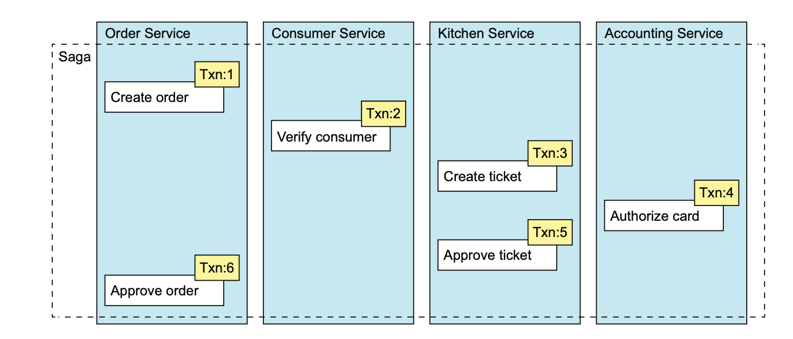

以Saga的方式管理事务
================
- [以Saga的方式管理事务](#以saga的方式管理事务)
  - [跨服务的事务场景](#跨服务的事务场景)
  - [1. 为什么需要分布式事务？](#1-为什么需要分布式事务)
  - [2. 分布式事务的问题](#2-分布式事务的问题)
    - [2.1 什么是两阶段提交？](#21-什么是两阶段提交)
    - [2.2 CAP理论](#22-cap理论)
  - [3. 什么是Saga模式？](#3-什么是saga模式)
    - [3.1 什么是状态机(statemachine)?](#31-什么是状态机statemachine)
    - [3.1 如何使用Saga维持数据一致性？](#31-如何使用saga维持数据一致性)
  - [4. Saga管理事务的方式？](#4-saga管理事务的方式)
  - [5 如何实现“隔离性”？](#5-如何实现隔离性)
    - [5.1.1 更新丢失(lost updates)](#511-更新丢失lost-updates)
    - [5.1.2  脏读（Dity read）](#512--脏读dity-read)
    - [5.3 解决方法](#53-解决方法)

## 跨服务的事务场景

1. Order Service — 创建订单并设置状态为APPROVAL_PENDING.
2. ConsumerService — 验证客户是否可下单。
3. Kitchen Service — 验证订单信息，并创建状态为CREATE
_PENDING的Ticket（也就是Kitchen Service自己的Order）。
1. Accounting Service — 授权客户的信用卡。
2. Kitchen Service — 更改Ticket的状态为AWAITING_ACCEPTANCE.
3. Order Service — 更改订单的状态为APPROVED.

## 1. 为什么需要分布式事务？

ACID

A： 原子

~~C~~:  

I:  并发

乐观锁

update  set content  where content == content ;

~~D: 持久性~~

## 2. 分布式事务的问题

### 2.1 什么是[两阶段提交](https://zhuanlan.zhihu.com/p/35616810)？
目的：保证原子性，即， 所有的参与者要么全部提交，要么全部回滚。

两阶段提交(2PC)，先投票，再提交。

* NoSQL的数据库不支持2PC
* Message queue 不支持2PC
* 无法保证可用性

### 2.2 [CAP理论](https://cloud.tencent.com/developer/article/1860632)

一致性（Consistency）、可用性（Availability）和分区容错性（Partition tolerance）

## 3. 什么是[Saga模式](http://microservices.io/patterns/data/saga.html)？

基于异步消息，协调一系列本地事务，以保证数据最终一次性。通常通过状态机的方式来实现。

### 3.1 什么是状态机(statemachine)?

由一系列的状态和状态之间的transition（转换）组成，transition通过事件触发。 每个transition可以有操作。对Saga而言，就是调用对应的参与者(即服务)

### 3.1 如何使用Saga维持数据一致性？

* Pivot transactions

* Compensating transactions

## 4. Saga管理事务的方式？

* 分散(Choreography)
    
* 中心(Orchestration)

    

## 5 如何实现“隔离性”？

ACID(原子性、~~一致性~~、隔离性、~~持久性~~)

在跨服务，没有数据库事务的情况，我们在微服务系统要面临：

### 5.1.1 更新丢失(lost updates)

1. `Create Order Saga` 在第一步创建了一个订单。
2.  在其正在执行期间， `Cancel Order Saga`取消订单。
3. `Create Order Saga`的最后一步确定了订单。

两种办法解决这个问题： 

1. 在订单处于APPROVED_PENDING状态时，不取消订单，等待订单执行完后，再执行取消操作。

2. 
### 5.1.2  脏读（Dity read）

在两个Saga的执行期间，一个读取到了另外的Saga的数据。比如`Cancel Order Saga`取消订单，会执行一下步骤。

* ConsumerService — 增加行用卡额度
* Order Service — 更改订单状态为Cancelled
* DeliveryService — 取消配送

假设 `Create Order Saga` 和 `Cancel Order Saga`同时执行。 `Cancel order Saga`撤销了（可能应为是某种神奇的原因，订单不能被取消了），那么有可能:

1. CancelOrderSaga — 增加行用卡额度
2. CreateOrderSaga — 减少行用卡额度
3. CancelOrderSaga — （Cancel Order Saga失败了）一个补偿性事务，减少信用卡额度。

在这种情况下， CreateOrderSaga就可能超过额度， 创建订单。

* 不可重复读

### 5.3 解决方法

* 语义化版本锁(Semantic lock) — 应用层锁
* 可交换更新(Commutative updates) — 以任何顺序执行操作， 比如 扣款和退款， 无论是先执行退款，还是扣款最终结果时一样的。
  
* Pessimistic view — 调整Saga中步骤的顺序，以最小化业务出错风险 

* Reread value — 通过再次读取数据，确保仅在数据未改变的情况再写入数据。这其实一种乐观锁

   `Optimistic Locking(乐观锁)` 在获取一条记录的时候，你记住它的版本，保存的时候，检查版本是否有变化，仅在没变化时，才写入。

    `Pessimistic Locking（悲观锁）` 直接以独占的方式锁定这条记录，不让其它人访问他。
    
* Version file — 记录记录的变更，以便可调整顺序。
* 
* By value — 根据价值决定采用什么样的并发方式。

