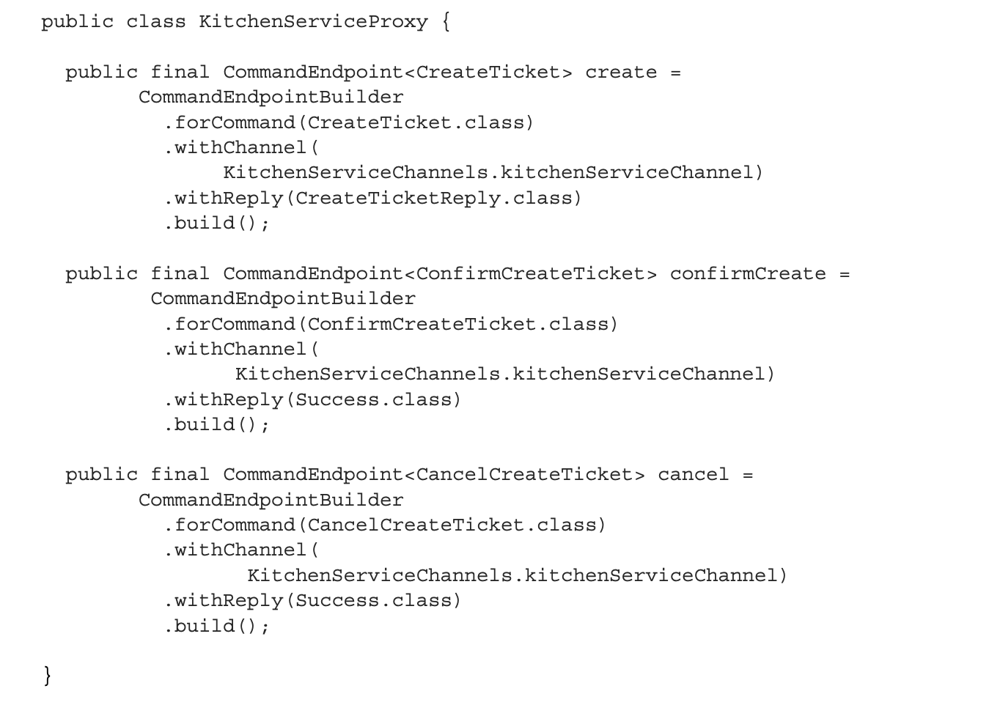

The design of the Order Service and the Create Order Saga
===

- [The design of the Order Service and the Create Order Saga](#the-design-of-the-order-service-and-the-create-order-saga)
  - [OrderService](#orderservice)
    - [CreateOrder](#createorder)
    - [CreateOrderSaga](#createordersaga)
      - [实现Create Order Saga](#实现create-order-saga)
        - [实现CreateoOrderSaga协调者](#实现createoordersaga协调者)
        - [CreateOrderSagaState class](#createordersagastate-class)
        - [KitchenServiceProxy class](#kitchenserviceproxy-class)
      - [OrderCommandHandlers class](#ordercommandhandlers-class)
    - [创建CreateOrderSaga实例的流程](#创建createordersaga实例的流程)
  - [参考： eventuate tram saga 框架](#参考-eventuate-tram-saga-框架)
  - [问题1： SagaManager如何可靠的把消息发送给saga的参与者？](#问题1-sagamanager如何可靠的把消息发送给saga的参与者)
  - [问题2： saga的参与者回复消息时，如何知道属于哪个saga?](#问题2-saga的参与者回复消息时如何知道属于哪个saga)

OrderService: 是订单核心业务逻辑，其中，实现了下单流程。

CreateOrderSaga： 创建订单saga协调者，通过调用对应的Proxy（KitchenServiceProxy and OrderServiceProxy）,发送命令消息给saga的参与者。

OrderCommandHandlers:  处理由OrderService发出的命令消息。

## OrderService

### CreateOrder

### CreateOrderSaga

#### 实现Create Order Saga

* CreateOrderSaga
* 
    单例， 定义了创建订单saga的状态机，它调用CreateOrderSagaState的创建命令消息，并通过saga参与者的代理类(KitchenServiceProxy)，发送这些消息给saga的参与者，
  
* CreateOrderSagaState

    创建订单saga的可持久化状态，它创建命令消息。

* Saga participant proxy classes
  
    如KitchenServiceProxy, 定于saga参与者的消息接口，接口由channel, 命令消息的类型，及h回复消息的类型。

##### 实现CreateoOrderSaga协调者

##### CreateOrderSagaState class

 代表saga实例的状态，主要作用是，创建saga参与者之间的消息

##### KitchenServiceProxy class

定义Kitchen Service的命令消息端点(CommandEndpoint)，包括发送到哪个channel,回复的消息类型。

#### OrderCommandHandlers class

处理由OrderService发出的命令消息。

### 创建CreateOrderSaga实例的流程

## 参考： eventuate tram saga 框架

## 问题1： SagaManager如何可靠的把消息发送给saga的参与者？

## 问题2： saga的参与者回复消息时，如何知道属于哪个saga? 

比如Order Service中，同时存在CreateOrderSaga和CancelOrderSaga, 假设他们存在同样类型的回复消息，我们怎么知道这个消息属于哪一个Saga?