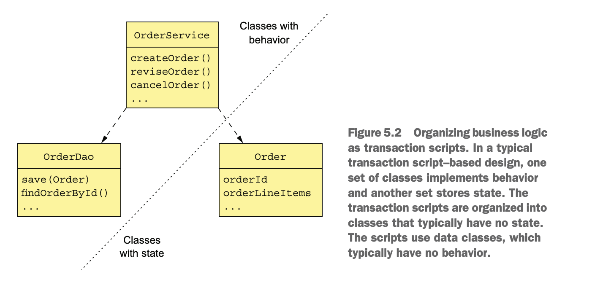
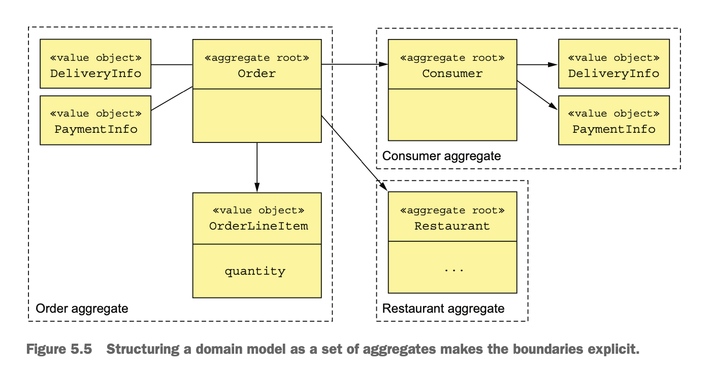

#  1. 在Micro Service体系下如何开发业务

## 2. 事务脚本以及领域模型

## 2.1 事务脚本

Organize the business logic as a collection of procedural transaction scripts, one for each type of request.

## 领域模型

Organize the business logic as an object model consisting of classes that have state and behavior.

## 3.  领域驱动（DDD）

* Entity
* Value Object
* Subdomains
* Factory
* Repository
* Aggregate
* Service

### 3.1 Aggregate是什么含义

Organize a domain model as a collection of aggregates, each of which is a graph of objects that can be treated as a unit.

#### 3.1.1 Aggregate的特征

Ensure that an aggregate is a self-contained unit that can enforce its invariants.

* 避免跨服务的Object reference, 即是多个Aggregate通过外键的值相互关联，而不是对象的引用。
  
* 一个事务只能更新创建和更新单个Aggregate,Aggregate满足Microservice的事务模型约束。

### 3.2 领域事件

An aggregate publishes a domain event when it’s created or undergoes some other significant change.

## 4. 示例
