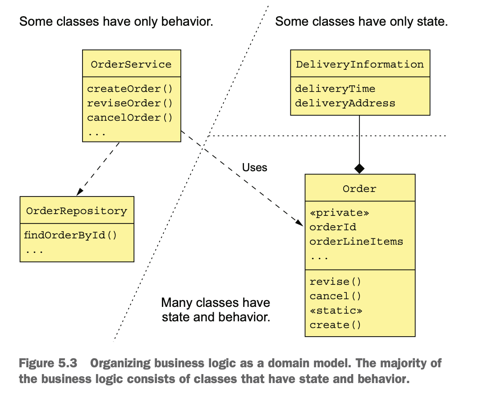
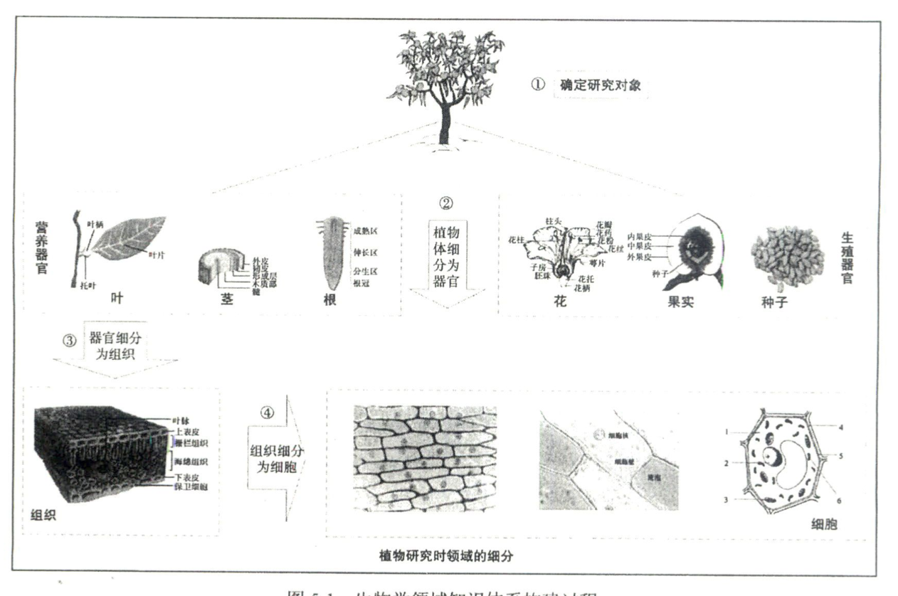
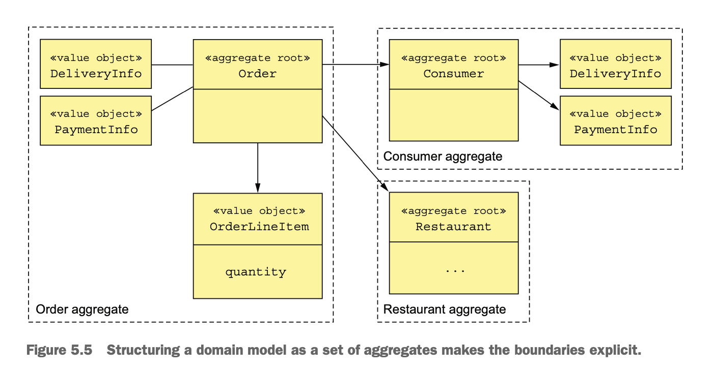
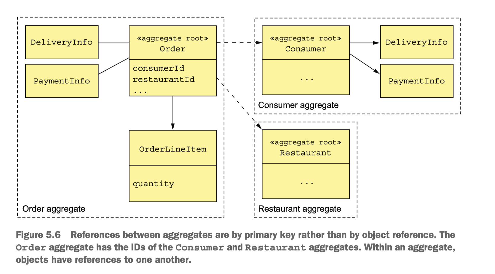

#  1. 在Micro Service体系下如何开发业务

- [1. 在Micro Service体系下如何开发业务](#1-在micro-service体系下如何开发业务)
  - [2. 事务脚本以及领域模型](#2-事务脚本以及领域模型)
  - [2.1 事务脚本](#21-事务脚本)
  - [领域模型](#领域模型)
  - [3.  领域驱动（DDD）](#3--领域驱动ddd)
    - [3.1 Aggregate是什么含义](#31-aggregate是什么含义)
      - [3.1.1 Aggregate的特征](#311-aggregate的特征)
    - [3.2 领域事件](#32-领域事件)
  - [4. 示例](#4-示例)
  - [5. 其它](#5-其它)

## 2. 事务脚本以及领域模型

## 2.1 事务脚本

Organize the business logic as a collection of procedural transaction scripts, one for each type of request.

## 领域模型

Organize the business logic as an object model consisting of classes that have state and behavior.

## 3.  领域驱动（DDD）

* Entity
* Value Object
* Subdomains
  
  核心子域， 通用子域和支撑子域， 
  ’子域’,和‘‘限界上下文”在大多数情况下是一对一或者一对多的映射关系。
* Factory
* Repository
* Aggregate
* Service
* Bounded contenxt（限界上下文）
  即限定了边界的上下文环境。 在—个明媚的早晨,孩子起床问妈妈:， ‘今天应该穿几件衣 服呀?”妈妈回答:‘‘能穿多少就穿多少!’,那到底是穿多还是穿少呢?
### 3.1 Aggregate是什么含义

Organize a domain model as a collection of aggregates, each of which is a graph of objects that can be treated as a unit.

#### 3.1.1 Aggregate的特征

Ensure that an aggregate is a self-contained unit that can enforce its invariants.

* 避免跨服务的Object reference, 即是多个Aggregate通过外键的值相互关联，而不是对象的引用。
  
* 一个事务只能更新创建和更新单个Aggregate,Aggregate满足Microservice的事务模型约束。

### 3.2 领域事件

An aggregate publishes a domain event when it’s created or undergoes some other significant change.

## 4. 示例

## 5. 其它

从现象到本质

从现象到抽象(即模式)

黑盒子

* 熟悉业务场景和业务流程
* 将技术能力匹配到业务上

即模式应用能力

[一个产品的落地：理想丰满，显示骨感](https://zhuanlan.zhihu.com/p/96724498)