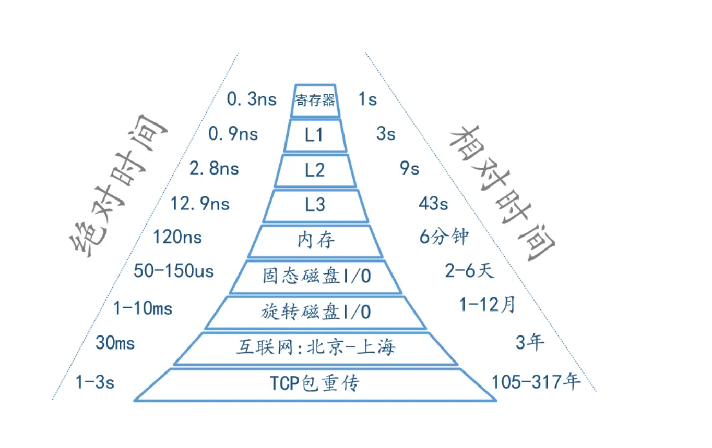

# Understanding database

- [Understanding database](#understanding-database)
  - [1. Document vs Relational database(文档与关系型数据库)](#1-document-vs-relational-database文档与关系型数据库)
  - [2. Column VS Row oriented database(列式与行式数据库)](#2-column-vs-row-oriented-database列式与行式数据库)
  - [3. Analytic database(分析型数据库)](#3-analytic-database分析型数据库)
  - [4. Database for SAAS application \(适用于多租户的数据库\)](#4-database-for-saas-application-适用于多租户的数据库)
    - [4.1 Old school - one database per tenant](#41-old-school---one-database-per-tenant)
    - [4.2 Saleforce multitenant arthitecture](#42-saleforce-multitenant-arthitecture)
    - [4.3 New fasion](#43-new-fasion)

## 1. Document vs Relational database(文档与关系型数据库)

[文档型数据库](https://www.zhihu.com/question/19714817)

## 2. [Column VS Row oriented database](https://en.wikipedia.org/wiki/Column-oriented_DBMS)(列式与行式数据库)

* Row

  * Row-oriented systems are designed to efficiently return data for an entire row, or record, in as few operations as possible.

  * row-oriented systems are not efficient at performing set-wide operations on the whole table, as opposed to a small number of specific records. For instance, in order to find all records in the example table with salaries between 40,000 and 50,000, the DBMS would have to fully scan through the entire table looking for matching records.
    
  * database indexes

Column

  Faster when only a limited subset of data is retrieved.

## 3. [Analytic database](https://searchbusinessanalytics.techtarget.com/definition/analytic-database)(分析型数据库)

## 4. Database for SAAS application \(适用于多租户的数据库\)

### 4.1 Old school - one database per tenant

### 4.2 [Saleforce multitenant arthitecture](./assets/Force.com_Multitenancy.pdf)

### 4.3 New fasion

* [citusdata](https://docs.citusdata.com/en/v10.2/)