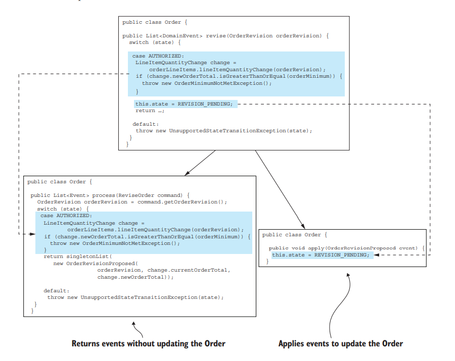

## [Event sourcing](https://microservices.io/patterns/data/event-sourcing.html)

Persist an aggregate as a sequence of domain events that represent state changes

- [Event sourcing](#event-sourcing)
- [1. 传统的方式 - 映射对象到表格](#1-传统的方式---映射对象到表格)
  - [2. 什么是Event sourcing呢?](#2-什么是event-sourcing呢)
    - [2.1 示例](#21-示例)
- [3. 通过快照提升性能](#3-通过快照提升性能)
- [4. 事件的演化](#4-事件的演化)
- [5. Event store](#5-event-store)
  - [5.1 表结构](#51-表结构)
  - [5.2 Event Store实现3种方法](#52-event-store实现3种方法)
    - [5.2.1 find](#521-find)
    - [5.2.2 create](#522-create)
    - [5.2.3 update](#523-update)
  - [5.3 订阅message broker来消费事件](#53-订阅message-broker来消费事件)
  - [5.4  事件中继(Event store)： 从database中发布事件到message broker原理](#54--事件中继event-store-从database中发布事件到message-broker原理)

## 1. 传统的方式 - 映射对象到表格


- [Object-Relational impedance mismatch](https://wikimili.com/en/Object-relational_impedance_mismatch).
  对象模型通常包含需要从多个表中分解和重建的对象的层次结构，而不是将对象存储为整体。

- Lack of aggregate history.
  无修改历史
- Implementing audit logging is tedious and error prone.
  实现审计日志比较麻烦
  [laravel 审计日志owen-it/laravel-auditing](https://packagist.org/packages/owen-it/laravel-auditing)

- Event publishing is bolted on to the business logic.
  
  事件的发布出现在业务逻辑中，而不是天然的自动发布。


### 2. 什么是Event sourcing呢?

以事件为中心的技术来实现业务逻辑和聚合的持久化


1. 创建或更新时，将事件写入events表
2. 获取时，从events表读取所有事件，再重建一个聚合。

#### 2.1 示例




## 3. 通过快照提升性能


## 4. 事件的演化

## 5. Event store

An event store
is a hybrid of a database and a message broker. It behaves as a database because it has
an API for inserting and retrieving an aggregate’s events by primary key. And it
behaves as a message broker because it has an API for subscribing to events.


- events — Stores the events
- entities — One row per entity
- snapshots — Stores snapshots

### 5.1 表结构

```
create table events (
  event_id varchar(1000) PRIMARY KEY,
  event_type varchar(1000),
  event_data varchar(1000) NOT NULL,
  entity_type VARCHAR(1000) NOT NULL,
  entity_id VARCHAR(1000) NOT NULL,
  triggering_event VARCHAR(1000)
)
```

triggering_event 识别重复

```
create table entities (
  entity_type VARCHAR(1000),
  entity_id VARCHAR(1000),
  entity_version VARCHAR(1000) NOT NULL,
  PRIMARY KEY(entity_type, entity_id)
)
```

```
create table snapshots (
  entity_type VARCHAR(1000),
  entity_id VARCHAR(1000),
  entity_version VARCHAR(1000),
  snapshot_type VARCHAR(1000) NOT NULL,
  snapshot_json VARCHAR(1000) NOT NULL,
  triggering_events VARCHAR(1000),
  PRIMARY KEY(entity_type, entity_id, entity_version)
)
```

### 5.2 Event Store实现3种方法

#### 5.2.1 find

- 从snapshots表获取一个实体最新的快照，如果有的话。
- 然后从events表获取所有那些event_id比快照的entity_version大的事件， 否则，获取全部事件。
- 从entity表获取实体的当前版本。

#### 5.2.2 create

插入一行数据到entity, events表， 


#### 5.2.3 update

插入数据到events表， 同时通过检查更新entity_version实现乐观锁。

```
UPDATE entities SET entity_version = ?
WHERE entity_type = ? and entity_id = ? and entity_version = ?
```

验证实体的版本没有变化，在没变化的情况下才更新entity_version到新的版本。

### 5.3 订阅message broker来消费事件


如何保证消息的顺序？


### 5.4  事件中继(Event store)： 从database中发布事件到message broker原理

事务日志跟踪（事务日志跟踪）

比如： MySQL版本的方案， 事件中继充当一个mysql 的slave角色， 然后读取它的binlog, 并将events表中的记录发布到message broker， 如Kafka, RabbitMQ等。事件中继部署为独立的进程，它周期记录当前的binlog—filename和offset到Kafaka的一个topic中，event database, message broker, and event relay 构成了Event store.