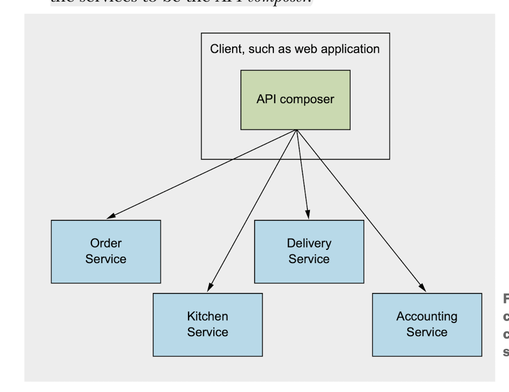

Implementing query
====

在微服务中实现查询


* API组合（API composition）
* 命令查询职责分离（Command query responsibility segregation，CQRS）


## 1. API组合


在哪里实现API聚合？

* 客户端
  
* API gateway
  
* 单独的服务
  

## 2. 命令查询职责分离

### 2.1 Command

CUD

### 2.2 Query

R

如 findOrderHistory() 操作获取客户的历史订单，它有以下几个参数：
* consumerId - 识别客户
* pagination - 历史订单
* filter 过滤条件, 包括哪个时间点的订单（orderCreatedAt），可选的订单状态, 可选的餐厅名、菜单项。


这个操作返回一些列OrderHistory记录，OrderHistory包含订单的汇总信息，如订单号、订单状态、订单总价、预计配送时间。


与前面findOrder的区别：

*  返回多个订单。 
  API compositor需要用同样的参数调用每个Service,问题是，有的服务，并没有对应的数据，比如只有 Order Service，Kitchen Service才有菜单信息。

* 有的服务无法进行排序。
  
  Kitchen Service， Delivery Service没有orderCreatedAt。

#### 2.2.1 In memory join

#### 2.2. 2. Dedicated data view


## How to keep data syncronized crossing services

Let's assume OrderHistoryService as a dedicated database-ElasticSearch which needs all data related to order from other services.

OrderHistoryEventHandler subscripes domain events published by MessageQueue
```
    -> order.created
    -> customer.updated
    -> ...
```


### Issues

* Handle duplicated messages
    * 1.1 
    ```
        PROCESSED_EVENT table
        eventId
        maxEventId
    ```
    * 1.2 
        idempotent(幂等性)